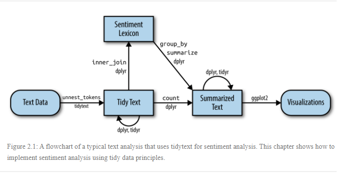
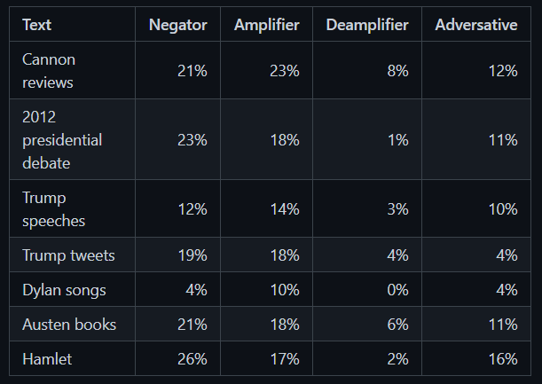

```{r setup, include=FALSE}
knitr::opts_chunk$set(echo = TRUE)
```


## {.tabset .tabset-pills}

### Overview

All of the following is referenced from @tidytext

Let’s address the topic of opinion mining or sentiment analysis. When human readers approach a text, we use our understanding of the emotional intent of words to infer whether a section of text is positive or negative, or perhaps characterized by some other more nuanced emotion like surprise or disgust.



**In this assignment, you should start by:** 

- getting the primary example code from chapter 2 working in an R    Markdown document.  
- provide a citation to this base code.  

**You’re then asked to extend the code in two ways:**

- Work with a different corpus of your choosing
- Incorporate at least one additional sentiment lexicon (possibly    from another R package that you’ve found through research).

### Packages

```{r message=FALSE, warning=FALSE}
library(tidytext)
library(tidyverse)
library(janeaustenr)
library(ggplot2)
library(wordcloud)
library(reshape2)
library(textdata)
library(sentimentr)
library(stringr)
library(dplyr)


```


### Lexicons

- **AFINN** lexicon grades words between -5 and 5 (positive scores     indicate positive sentiments)

```{r affin}
get_sentiments("afinn")
```

- **NRC** lexicon categorizes sentiment words into positive,         negative, anger, anticipation, disgust, fear, joy, sadness,        surprise and trust

```{r nrc}
get_sentiments("nrc")
```


- **Bing** lexicon uses a binary categorization model that sorts words into positive or negative positions

```{r bing}
get_sentiments("bing")
```

**SentimentR Package**

Sentimentr is designed to quickly calculate text polarity sentiment at the sentence level and optionally aggregate by rows or grouping variable(s).

```{r sentimentr, echo=FALSE, eval=FALSE}
library(sentimentr)
```

sentimentr attempts to take into account valence shifters (i.e., negators, amplifiers (intensifiers), de-amplifiers (downtoners), and adversative conjunctions) while maintaining speed. Simply put, sentimentr is an augmented dictionary lookup.




```{block, type = "rmdwarning"}
 
    These lexicons are available under different licenses, so be sure that the license for the lexicon you want to use is appropriate for your project. You may be asked to agree to a license before downloading data.
```

### Sentiment Analysis

#### {.tabset}
##### Tidytext Package

**Working on the books included inside the tidytext**

All of the following is referenced from @tidytext

```{r tidy books}
tidy_books <- austen_books() %>%
  group_by(book) %>%
  mutate(
    linenumber = row_number(),
    chapter = cumsum(str_detect(text, 
                                regex("^chapter [\\divxlc]", 
                                      ignore_case = TRUE)))) %>%
  ungroup() %>%
  unnest_tokens(word, text)
  
```

```{r}
nrc_joy <- get_sentiments("nrc") %>% 
  filter(sentiment == "joy")

tidy_books %>%
  filter(book == "Emma") %>%
  inner_join(nrc_joy) %>%
  count(word, sort = TRUE)
```


**We can also examine how sentiment changes throughout each novel**

we find a sentiment score for each word using the Bing lexicon and `inner_join()`

```{block, type = "rmdtip"}
The `%/%` operator does integer division (`x %/% y` is equivalent to `floor(x/y)`) so the index keeps track of which 80-line section of text we are counting up negative and positive sentiment in. 
```

```{r}
jane_austen_sentiment <- tidy_books %>%
  inner_join(get_sentiments("bing")) %>%
  count(book, index = linenumber %/% 80, sentiment) %>%
  pivot_wider(names_from = sentiment, values_from = n, values_fill = 0) %>% 
  mutate(sentiment = positive - negative)
```

**Comparing the three sentiment dictionaries for the Novel Pride & Prejudice**

```{block, type = "rmdnote"}
Remember from above that the AFINN lexicon measures sentiment with a numeric score between -5 and 5, while the other two lexicons categorize words in a binary fashion, either positive or negative. To find a sentiment score in chunks of text throughout the novel, we will need to use a different pattern for the AFINN lexicon than for the other two. @tidytext
```

```{r pride_prejudice, dependson = "tidy_books"}
pride_prejudice <- tidy_books %>% 
  filter(book == "Pride & Prejudice")
pride_prejudice
```

**We now have an estimate of the net sentiment (positive - negative) in each chunk of the novel text for each sentiment lexicon**

```{r compare sentiment}
afinn <- pride_prejudice %>% 
  inner_join(get_sentiments("afinn")) %>% 
  group_by(index = linenumber %/% 80) %>% 
  summarise(sentiment = sum(value)) %>% 
  mutate(method = "AFINN")
bing_and_nrc <- bind_rows(
  pride_prejudice %>% 
    inner_join(get_sentiments("bing")) %>%
    mutate(method = "Bing et al."),
  pride_prejudice %>% 
    inner_join(get_sentiments("nrc") %>% 
                 filter(sentiment %in% c("positive", 
                                         "negative"))
    ) %>%
    mutate(method = "NRC")) %>%
  count(method, index = linenumber %/% 80, sentiment) %>%
  pivot_wider(names_from = sentiment,
              values_from = n,
              values_fill = 0) %>% 
  mutate(sentiment = positive - negative)
```

##### SentimentR Package

Using the sentiment function we obtain a new way to see the data using Element ID, Sentence_id, word_count, sentiment

```{r dependant on sentimentr}

pp_lexicon2 <- prideprejudice %>%
  get_sentences() %>%
  sentiment()

tibble(pp_lexicon2)

```

```{r}
lexicon2_polarity <- pp_lexicon2 %>%
  mutate(polarity_level = ifelse(sentiment > 0, "Positive", "Negative"))

tibble(lexicon2_polarity)
```


### Graphs

#### {.tabset}
##### Tidytext


Now we can plot these sentiment scores across the plot trajectory of each novel

```{r}
ggplot(jane_austen_sentiment, aes(index, sentiment, fill = book)) +
  geom_col(show.legend = FALSE) +
  facet_wrap(~book, ncol = 2, scales = "free_x")
```

##### Pride & Prejudice

**Comparing three sentiment lexicons using *Pride and Prejudice* - **
```{r compareplot, dependson = "comparesentiment", fig.cap="(ref:comparecap)"}
bind_rows(afinn, 
          bing_and_nrc) %>%
  ggplot(aes(index, sentiment, fill = method)) +
  geom_col(show.legend = FALSE) +
  facet_wrap(~method, ncol = 1, scales = "free_y")
```


##### SentimentR

**Pride & Prejudice**

This is a plot that shows how the sentiment looks like. we can see that the tone for the book is very neutral according to the sentimentr package

```{r}

pp_lexicon2 %>%
  ggplot() + geom_density(aes(sentiment))
 

```

**Obtaining positive and negative values from Pride and Prejudice book**

From this graph we are able to determine that there are more negative weighted words than positive


```{r}

library(ggplot2)

ggplot(lexicon2_polarity) +
 aes(x = polarity_level, fill = polarity_level) +
 geom_bar() +
 scale_fill_hue(direction = 1) +
 theme_minimal()


```


### Conclusion

**Sentiment analysis** can be incredibly powerful if done correctly. In order to have a powerful story to tell about the text you are analyzing, you need to make sure you are asking the right questions about the text. By this I mean, are you seeing how positive or negative a text is? Or are you trying to see what emotions are contained within your text? Or are you looking for something else? Answering these questions will help you answer the most important question of you analysis: Which lexicon should I use?

In this analysis we were able to determine different ways to work with dictionaries depending on our ultimate goal or question.

We focused in the Pride & Prejudice book.

We were able to determine a higher level of negativity using the the dictionaries included in the sentimentr package. Sentimentr uses valence shifters. a negator flips the sign of a polarized word.

## {-}
