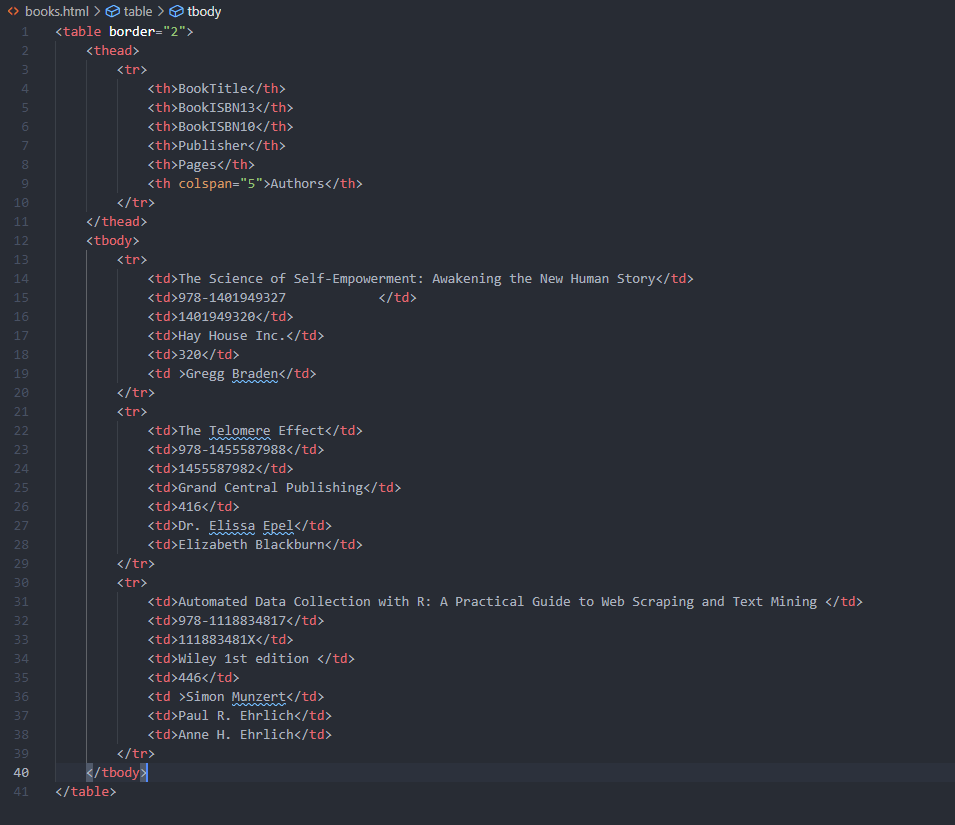
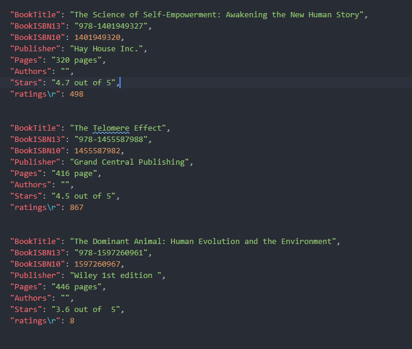
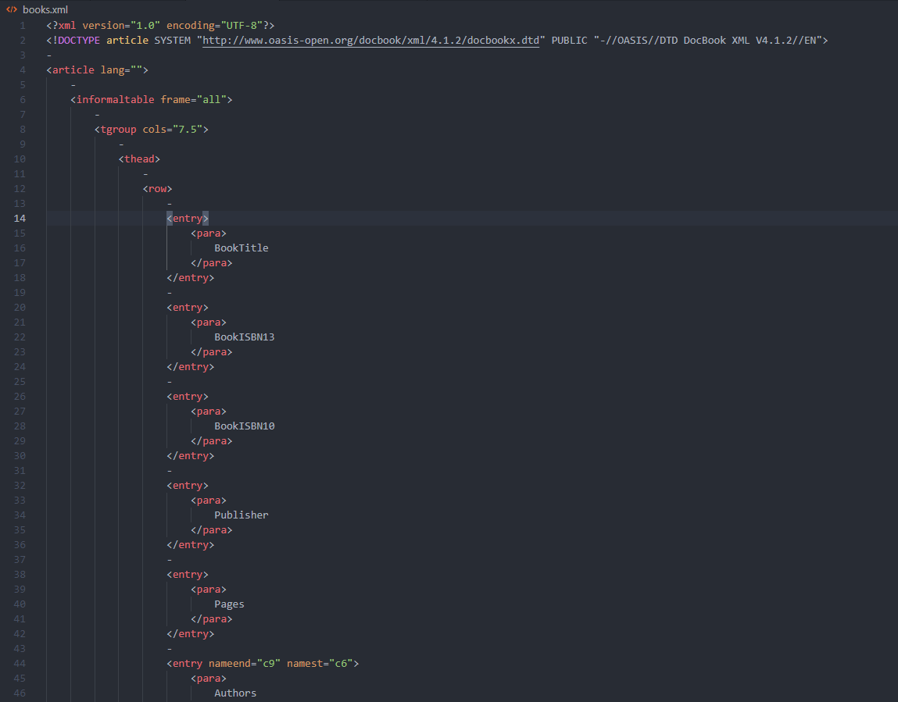

## Working with XML and JSON in R 


Pick three of your favorite books on one of your favorite subjects. At least one of the books should have more than one author. 
For each book include:
-the title 
-authors
-two or three other attributes that you find interesting

Take the information that you’ve selected about these three books, and separately create three files which store the book’s information in HTML (using an html table), XML, and JSON formats (e.g. “books.html”, “books.xml”, and “books.json”). 
To help you better understand the different file structures, create each of these files “by hand” unless you’re already very comfortable with the file formats.

# _________________________________________________________________________#
### Packages:

* Rcurl

* XML

* jsonlite

```{r, echo=FALSE, results= "hide", warning=FALSE, message=FALSE}

library(RCurl)
library(xml2)
library(jsonlite)
library(textreadr)
library(rvest)
library(dplyr)
library(htmltab)
library(DT)
library(XML)
library(readr)


```

# _________________________________________________________________________#
### HTML



*Using Github URL*


```{r, warning=FALSE}

url <- ("https://raw.githubusercontent.com/mgino11/Books_Json_XML/main/Book_files/books.html")
xp <- "//table[1]"
df_html <- htmltab(url, rm_nodata_cols = F, which = xp)

datatable(df_html)

```


# _________________________________________________________________________#
  
### JSON FILE



```{r, warning= FALSE}
jason_file <- fromJSON("https://raw.githubusercontent.com/mgino11/Books_Json_XML/main/Book_files/books.json")
json_df <- as_data_frame(jason_file)
datatable(jason_file)

```
  

# _________________________________________________________________________#
### XML File 




```{r, eval=FALSE}
filename <- "Book_files\books.xml"
xml_book <- xmlInternalTreeParse(filename)
xml_df <- xmlToDataFrame(xml_book)

```

# _________________________________________________________________________#
#### Conclusions

XML looks familiar to someone with basic knowledge about HTML, as it shares the same features of a markup language. Nevertheless, HTML and XML both serve their own specific purposes. While HTML is used to shape the display of information, the main purpose of XML is to store data.

XML is data wrapped in user-defined tags. The user-defined tags make XML much more flexible for storing data than HTML.Indentation further facilitates reading but is not a necessary component of XML.

Another standard for data storage and interchange we frequently find on the Web is the JavaScript Object Notation, abbreviated JSON.
JSON is an increasingly popular alternative to XML for data exchange purposes that comes with some preferable features. JSON was designed for the same tasks that XML is often used for—the storage and exchange of human-readable data. Many APIs by popular web applications provide data in the JSON format.


