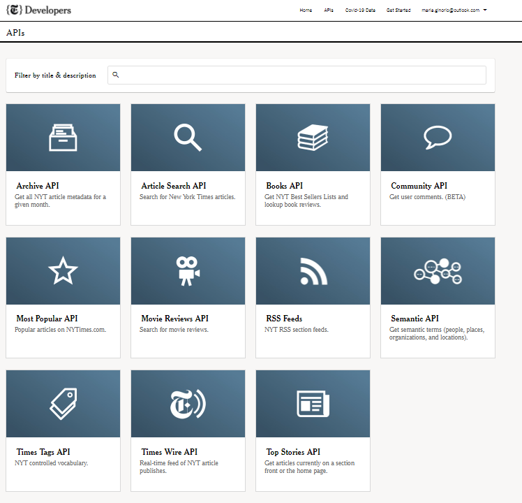
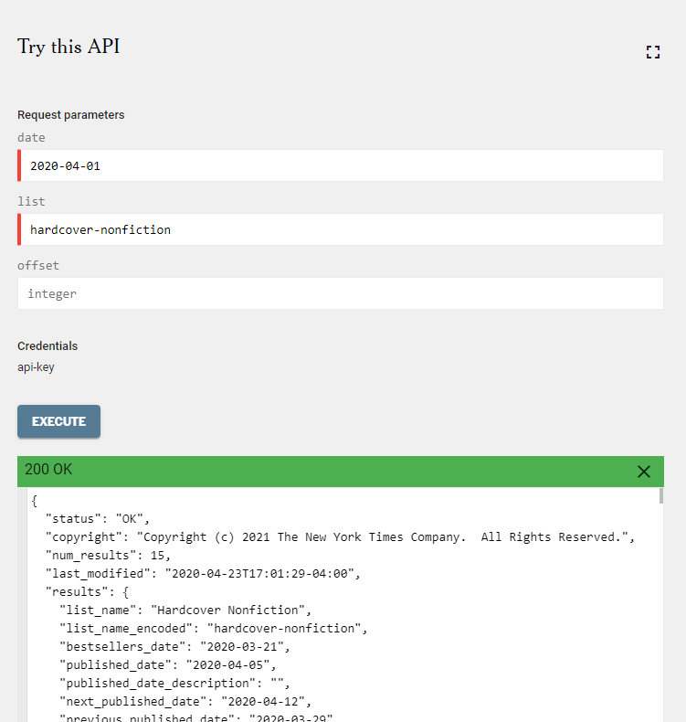
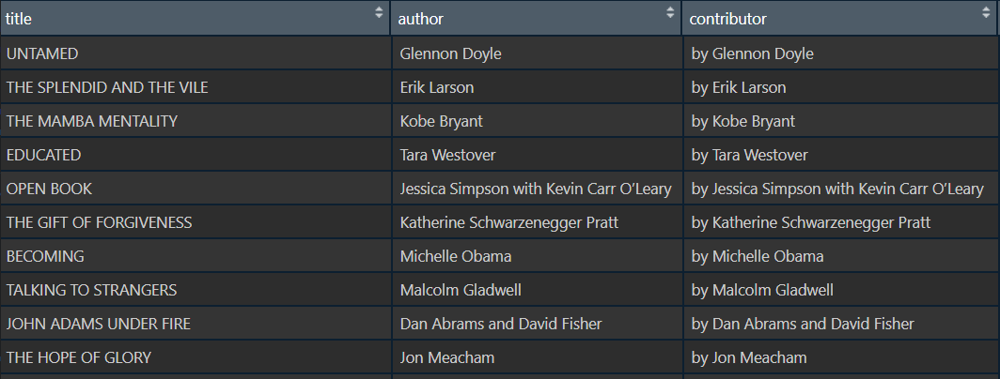

```{r setup, include=FALSE}
knitr::opts_chunk$set(echo = TRUE)
```

### Interface for JSON Data
##### Overview
### {.tabset .tabset-pills}

#### Overview

The New York Times web site provides a rich set of APIs, as described here: https://developer.nytimes.com/apis

The task is to choose one of the New York Times APIs, construct an interface in R to read in the JSON data, and transform it into an R DataFrame.



#### Packages

```{r packages, message=FALSE, warning=FALSE}
library(knitr)
library(jsonlite)
library(httr)
library(glue)
library(dplyr)
library(shiny)

```

#### Parameters

**Construct an interface in R to read in the JSON data, and transform it into an R Data Frame.**

1. Construct URL Parameter with the desired data to be obtained


```{r api}

# https://api.nytimes.com/svc/books/v3/lists/current/hardcover-fiction.json?api-key=yourkey

```

2.- Obtain Json File from API




#### Read API

```{r url api}
url_string <- "https://api.nytimes.com/svc/books/v3/lists/{date}/{list}.json?api-key={api_key}"

```


**Parameters**

```{r}
api_key <- Sys.getenv("NYT_TOKEN")
list <- "hardcover-nonfiction"
date <- "2020-04-01"
```

```{r}
raw.data <- fromJSON(rawToChar(GET(glue(url_string))$content))
book.data <- raw.data$results$books

```



#### Dataframe

For the purpose of this project we will work with the following variables.

-Title
-Author
-Weeks on list
-Description
-Book Image

```{r}
book.rank.df <-
  book.data[,c("rank",
               "weeks_on_list",
               "title",
               "author",
               "description",
               "book_image")]
```

**Final Result**

```{r}
kable(head(book.rank.df,5),caption = "NYT Hardcover Nonfiction Top 5")
```

